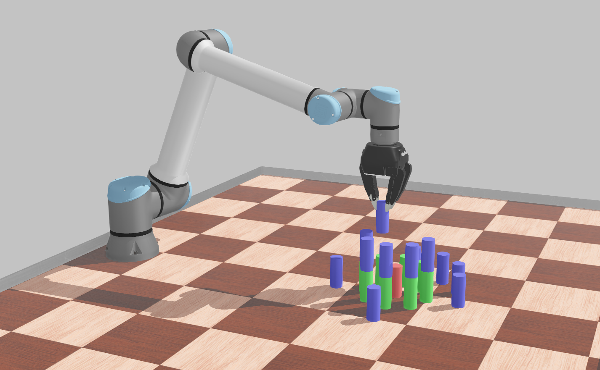
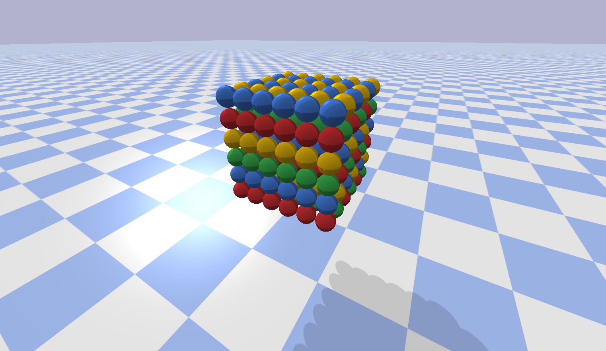
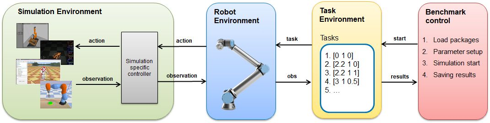

# Comparing Popular Simulation Environments in the Scope of Robotics and Reinforcement Learning

[](https://opensource.org/licenses/MIT)
[](https://doi.org/t.b.d.)
[](https://arxiv.org/abs/t.b.d.)

This repository provides the code used in our paper [Comparing Popular Simulation Environments in the Scope of Robotics and Reinforcement Learning](https://doi.org/t.b.d.), also available on [arXiv](https://arxiv.org/abs/t.b.d.).
The scope of this benchmark is to compare [Gazebo](http://gazebosim.org/), [MuJoCo](http://www.mujoco.org/), [PyBullet](https://pybullet.org/wordpress/), and [Webots](https://cyberbotics.com/).

- [Comparing Popular Simulation Environments in the Scope of Robotics and Reinforcement Learning](#comparing-popular-simulation-environments-in-the-scope-of-robotics-and-reinforcement-learning)
  - [Benchmark scenarios](#benchmark-scenarios)
    - [Scenario 1 - Robot Scenario](#scenario-1---robot-scenario)
      - [Workspace](#workspace)
      - [Robot](#robot)
      - [Gripper](#gripper)
      - [Cylinders](#cylinders)
    - [Scenario 2 - Sphere Scenario](#scenario-2---sphere-scenario)
  - [Benchmark architecture](#benchmark-architecture)
  - [Running the benchmark](#running-the-benchmark)
    - [Prerequisites](#prerequisites)
    - [Docker (recommended)](#docker-recommended)
    - [Manual installation](#manual-installation)
      - [Install Webots](#install-webots)
      - [Install ROS/Gazebo](#install-rosgazebo)
      - [Install MuJoCo](#install-mujoco)
    - [Manually running the benchmark](#manually-running-the-benchmark)
  - [Thanks](#thanks)

## Benchmark scenarios

Two benchmark scenarios were developed. With the option `sim_option` one of the twi scenarios can be choosen. For scenario 1  it is `"RobotSim"`, for scenario 2 it is `"nnnSim"`. All units are, unless otherwise noted, in SI units.

### Scenario 1 - Robot Scenario



#### Workspace

The workspace should delimit the work area, but also offer a defined surface for all contacts with the floor.
All object forming the workspace are colored in `#4d4d4d`.

| Object     | Position              | Size                 |
| ---------- | --------------------- | -------------------- |
| Main floor | `[0.0, 0.75, 0.01]`   | `[2.6, 1.8, 0.02]`   |
| Wall 1     | `[1.31, 0.75, 0.03]`  | `[0.02, 1.8, 0.06]`  |
| Wall 2     | `[-1.31, 0.75, 0.03]` | `[0.02, 1.8, 0.06]`  |
| Wall 3     | `[0.0, -0.16, 0.03]`  | `[2.64, 0.02, 0.06]` |
| Wall 4     | `[0.0, 1.66, 0.03]`   | `[2.64, 0.02, 0.06]` |

#### Robot

In this scenario, we are using an [UR10e](https://www.universal-robots.com/products/ur10-robot/) by Universal Robots:

| Object | Position           |
| ------ | ------------------ |
| UR10e  | `[0.0, 0.0, 0.02]` |

The initial position of the joints are defined as:

| Joint   | Name                | Position              |
| ------- | ------------------- | --------------------- |
| joint_0 | shoulder_pan_joint  | `1.411872641811951`   |
| joint_1 | shoulder_lift_joint | `-0.8420041879132294` |
| joint_2 | elbow_joint         | `1.0565325644929087`  |
| joint_3 | wrist_1_joint       | `-1.7859626190435058` |
| joint_4 | wrist_2_joint       | `-1.5704882948679586` |
| joint_5 | wrist_3_joint       | `1.4109012658608595`  |

Further information can be found at [ros-industrial/universal_robot](https://github.com/ros-industrial/universal_robot) and [Universal Robots](https://www.universal-robots.com/articles/ur-articles/parameters-for-calculations-of-kinematics-and-dynamics/)

#### Gripper

Coupled to the [UR10e](#robot) is the [3-Finger Adaptive Robot Gripper](https://robotiq.com/products/3-finger-adaptive-robot-gripper) by Robotiq.

#### Cylinders

All cylinders are the same size, i. e. a height of `0.1 m` and a diameter of `0.04 m`.
They are arranged in two coaxial circles with on single cylinder in the middle.
The naming is given by the circle the belong to (1: single middle cylinder, 2: inner cirlce, 3: outer circle) and their respective position along the circle.
The colors are defined as `#b34d4d`, `#4db34d`, `#4d4db3`, for the single cylinder, the inner circle, and the outer circle, respectivley.

| Cylinder      | Position                |
| ------------- | ----------------------- |
| cylinder_1    | `[0.0, 1.0, 0.07]`      |
| cylinder_2_1  | `[0.0, 1.1, 0.07]`      |
| cylinder_2_2  | `[0.071, 1.071, 0.07]`  |
| cylinder_2_3  | `[0.1, 1.0, 0.07]`      |
| cylinder_2_4  | `[0.071, 0.929, 0.07]`  |
| cylinder_2_5  | `[0.0, 0.9, 0.07]`      |
| cylinder_2_6  | `[-0.071, 0.929, 0.07]` |
| cylinder_2_7  | `[-0.1, 1.0, 0.07]`     |
| cylinder_2_8  | `[-0.071, 1.071, 0.07]` |
| cylinder_3_1  | `[0.0, 1.2, 0.07]`      |
| cylinder_3_2  | `[0.1, 1.173, 0.07]`    |
| cylinder_3_3  | `[0.171, 1.104, 0.07]`  |
| cylinder_3_4  | `[0.2, 1.0, 0.07]`      |
| cylinder_3_5  | `[0.171, 0.896, 0.07]`  |
| cylinder_3_6  | `[0.1, 0.827, 0.07]`    |
| cylinder_3_7  | `[0.0, 0.8, 0.07]`      |
| cylinder_3_8  | `[-0.1, 0.827, 0.07]`   |
| cylinder_3_9  | `[-0.171, 0.896, 0.07]` |
| cylinder_3_10 | `[-0.2, 1.0, 0.07]`     |
| cylinder_3_11 | `[-0.171, 1.104, 0.07]` |
| cylinder_3_12 | `[-0.1, 1.173, 0.07]`   |

### Scenario 2 - Sphere Scenario



Note: this scenario is also referenced to as `nnnSim` throughout the code.

The second scenario is designed to evaluate the performance of the simulation environments for calculating a large number of bodies and contacts simulatiously.
For this purpose, the model was designed with 216 spheres arranged as a cube with 6 spheres per side.
The the cube of spheres is placed such that the lowest layer of spheres is `1 m` above the ground.
To generate the same inital conditions for all simulation environemnts, the [generate_spheres_worlds.py](benchmark_controller\generate_spheres_worlds.py) script is used, automatically generating the equivalent world describtion for all simulation environments.
However, all spheres are slightly pertubated around their postion along the grid in the xy-plane.
This is necessary as for some simulation environments a perfect grid would lock the spheres in place and the the cube would not collapse.

## Benchmark architecture



The code is structured into a modular architecture with four models at its core.

- [Benchmark Control](instanz_manager.py):
this module is responsible for loading all required dependencies, specifying relevant parameters, as well as starting the respective simulations for each simulation environment.
At the end of each simulation run, the collected data is stored in a `.json` file.

- [Task Environment](benchmark_controller/task_env.py):
it defines the task of the simulation environment.
Here, lists of robot axis positions are provided.
This module was developed based on the OpenAI Gym template.
Thus, the methods `step()` and `reset()` are implemented to trigger a simulation step and reset the simulation, respectivley.
Only minor adjustments would be required to adapt our code to a Gym Environment.

- Robot Environment:
the third module controls the robot, which is assembeled from the [UR10e](#robot) and [3-Finger Adaptive Robot Gripper](#gripper).
Inside this module, the model information is retrieved and the provided axis positions are processed.
Additionally, the observation data is structured and formatted as a dictionary variable.
Given the different simulation environments and their different structure and data processing, one robot environment was developed per simulation environment.

- Simulation Environment:
the last module handels two important tasks, the simulation model as well as the simulation interface.
The models are either created in a simulation-specific format or in `.urdf` format.
For control and data queries, a separate simulation-specific controller is required.
It is responsible for providing an interface between the simulation and the robot environment.
Again given the vastily different structure of the simulation environments, the controller was adapted to each simulation environment specifically.

## Running the benchmark

### Prerequisites

Below is the software we used.
We cannot guarantee older versions of the software to work.
Yet, newer software is most likely working just fine.

| Software      | Version        |
| ------------- | -------------- |
| OS            | Ubuntu 20.04.1 |
| NVIDIA Driver | 455.23.04      |
| NVIDIA-Docker | 2.5.0-1        |
| Docker        | 19.03.13       |

Additional software required for manually running the benchmark:

| Software | Version         |
| -------- | --------------- |
| Python   | 3.8.2           |
| ROS      | Noetic Ninjemys |
| Gazebo   | 11.1.0          |
| MuJoCo   | 200             |
| PyBullet | 2.8.4           |
| Webots   | 2020b-rev1      |

### Docker (recommended)

To build the Dockerfile, run the following command it the root of this repo:

```shell
docker build --no-cache -t simbenchmark -f ./dockerfiles/Dockerfile .
```

Now, you can run the benchmark with:

```shell
docker run --gpus all -v $HOME/tmp:/root/simbenchmark/results:rw --rm -it simbenchmark
```

Or, to manually start the script inside the docker container:

```shell
docker run --gpus all -v $HOME/tmp:/root/simbenchmark/results:rw --rm -it --entrypoint /bin/bash simbenchmark
```

### Manual installation

Install required apt packages:

```shell
sudo apt update
sudo apt install collectl
```

Install the required Python packages from the [`requirements.txt`](requirements.txt).
This also installs PyBullet.

```shell
python3 -m pip install -r requirements.txt
```

Finally, clone this repository:

```shell
git clone https://github.com/zal/simenvbenchmark.git
```

Note:
Instead of adding additional environmental variables to your `~/.bashrc` or `~/.zshrc`, you can utilize the provided [`.envrc`](.envrc) file.
First, install `direnv` as an apt-package and second, allow the loading of the variables via `direnv allow .` in the root of this repository.

#### Install Webots

We are using [WeBots R2020b-rev1](https://github.com/cyberbotics/webots/releases/tag/R2020b-rev1).
It can be downloaded installed from [here](https://github.com/cyberbotics/webots/releases/download/R2020b-rev1/webots_2020b-rev1_amd64.deb).

```shell
wget --no-verbose https://github.com/cyberbotics/webots/releases/download/R2020b-rev1/webots_2020b-rev1_amd64.deb
apt install -y ./webots_2020b-rev1_amd64.deb
rm ./webots_2020b-rev1_amd64.deb
```

Setup your [environmental variables for Webots](https://www.cyberbotics.com/doc/guide/running-extern-robot-controllers?tab-os=linux&tab-language=python#environment-variables/) as:

```shell
echo "export LD_LIBRARY_PATH=$LD_LIBRARY_PATH:/usr/local/webots/lib/controller" >> ~/.bashrc
echo "export WEBOTS_HOME=/usr/local/webots" >> ~/.bashrc
echo "export PYTHONPATH=$PYTHONPATH:/usr/local/webots/lib/controller/python38 #(or python37)" >> ~/.bashrc
echo "export PYTHONIOENCODING=UTF-8" >> ~/.bashrc
```

Source your `.bashrc` to apply those changes: `source ~/.bashrc`.
For `zsh`, replace `~/.bashrc` with `~/.zshrc`.

#### Install ROS/Gazebo

To install ROS/Gazebo, you can either follow the official [Installation instructions](http://wiki.ros.org/noetic/Installation/Ubuntu) for ROS noetic and install `ros-noetic-desktop-full` which comes pre-packed with Gazebo.
Or, use the commands provided below to only install the necessary packages:

```shell
sudo sh -c 'echo "deb http://packages.ros.org/ros/ubuntu $(lsb_release -sc) main" > /etc/apt/sources.list.d/ros-latest.list'
sudo apt-key adv --keyserver 'hkp://keyserver.ubuntu.com:80' --recv-key C1CF6E31E6BADE8868B172B4F42ED6FBAB17C654
sudo apt update && sudo apt install \
    gazebo11 \
    libgazebo11-dev \
    python3-catkin-tools \
    python3-rosdep \
    python3-rosinstall \
    python3-rosinstall-generator \
    python3-wstool \
    ros-noetic-ros-core
echo "source /opt/ros/noetic/setup.bash" >> ~/.bashrc
sudo rosdep init; rosdep update
```

#### Install MuJoCo

Install issing dependencies according to [ethz-asl/reinmav-gym #35](https://github.com/ethz-asl/reinmav-gym/issues/35) and [openai/mujoco-py #147](https://github.com/openai/mujoco-py/issues/147).

```shell
apt install libosmesa6-dev patchelf
```

Download [`mujoco200_linux.zip`](https://www.roboti.us/download/mujoco200_linux.zip) from [roboti.us](https://www.roboti.us/index.html) and place it into `~/.mujoco`:

```shell
mkdir -p ~/.mujoco
wget https://www.roboti.us/download/mujoco200_linux.zip
unzip ./mujoco200_linux.zip -d ~/.mujoco
mv ~/.mujoco/mujoco200_linux ~/.mujoco/mujoco200
rm ./mujoco200_linux.zip
```

Apply for license on [mujoco’s license site](https://www.roboti.us/license.html/).
You will get a mail with the key `mjkey.txt` attached.
This is your license file.
Place it into the `.mujoco/mujoco200/bin` folder.
Add a line in your `~/.bashrc` file to add append the `LD_LIBRARY_PATH` variable.

```shell
echo "export LD_LIBRARY_PATH=$LD_LIBRARY_PATH:/root/.mujoco/mujoco200/bin" >> ~/.bashrc
```

Again, source your `.bashrc`.

Now you can install the [MuJoCo Python wrapper](https://openai.github.io/mujoco-py/build/html/index.html/):

```shell
python3 -m pip install mujoco-py
```

### Manually running the benchmark

You can run all benchmarks one after another using:

```shell
./run_all_benchmarks.sh
```

## Thanks

This work is partially funded through the German Federal R&D aid scheme for the aeronautics sector - (LuFo VI) by the Federal Ministry of Economic Affairs (BMWi), supported by the Project Management Agency for Aeronautics Research (PT-LF), a division of the German Aerospace Center (DLR).
Project 20D1926: Artificial Intelligence Enabled Highly Adaptive Robots for Aerospace Industry 4.0 (AIARA).
